# Guía de uso de Mi UTEM

Recorrido completo de la app **Mi UTEM 4.0.0 (build 153)**, verificado en el simulador de iOS (iPhone 17, iOS 26).

> **Sobre las capturas**: se tomaron ejecutando la app en *modo capturas*
> (`--dart-define=SCREENSHOT_MODE=true`), que reemplaza los servicios de red por los datos
> ficticios de [`lib/core/mock/mock_data.dart`](../lib/core/mock/mock_data.dart). El estudiante
> "Ernesto Carreño Silva", su RUT, sus ramos y sus notas **no corresponden a ninguna persona ni
> matrícula real**. Las pantallas, la navegación y los estados de carga son los mismos que ve
> cualquier estudiante con su cuenta real.

---

## 1. Cómo acceder a la app

### 1.1 Qué necesitas

- Un dispositivo iOS o Android con la app Mi UTEM instalada.
- Tus credenciales de **Pasaporte.UTEM** (las mismas del correo institucional y de
  [mi.utem.cl](https://mi.utem.cl/)).
- Conexión a internet en el primer inicio de sesión.

### 1.2 Iniciar sesión

Al abrir la app por primera vez aparece la pantalla de acceso: el logo de Mi UTEM sobre un video de
fondo del campus, y el formulario de ingreso.

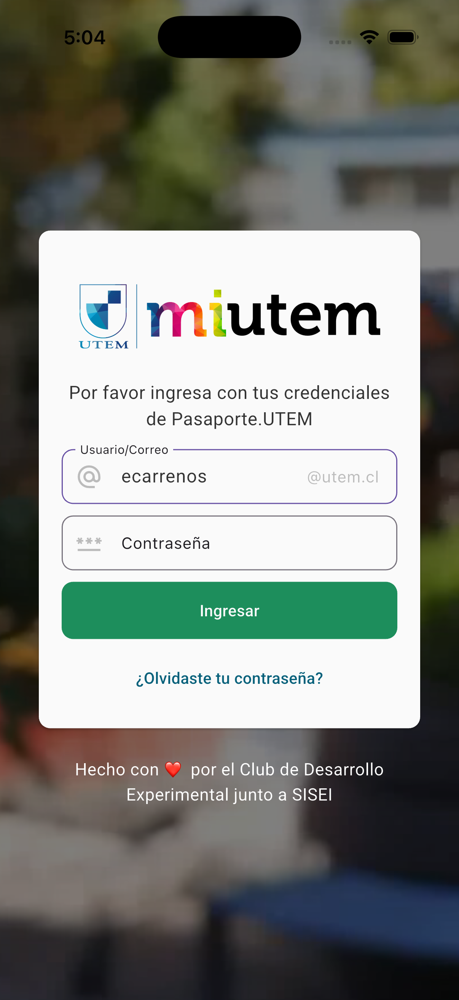

1. **Usuario/Correo**: escribe solo tu nombre de usuario (por ejemplo `ecarrenos`). La app agrega
   automáticamente el sufijo `@utem.cl` que se muestra al costado derecho del campo, así que no
   hace falta escribir el correo completo.
2. **Contraseña**: tu contraseña de Pasaporte.UTEM. Se oculta con puntos mientras la escribes.
3. Pulsa **Ingresar**.

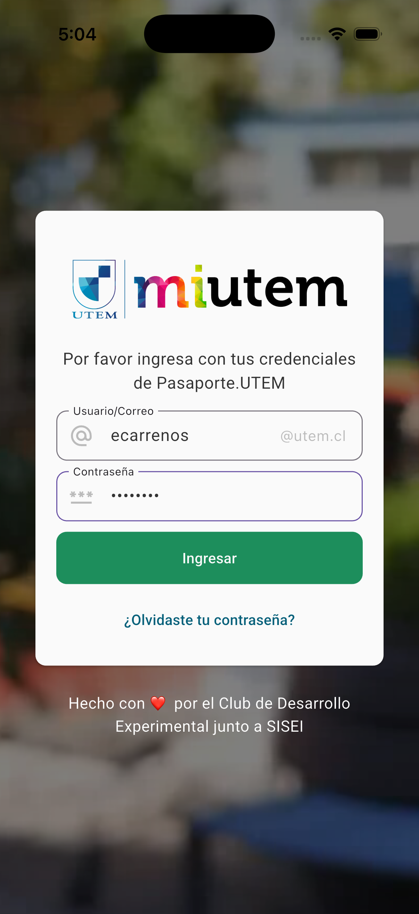

Notas útiles:

- El formulario está integrado con el **llavero de iOS / autocompletado**, por lo que el sistema
  puede ofrecerte guardar y rellenar la contraseña.
- **¿Olvidaste tu contraseña?** abre [pasaporte.utem.cl/reset](https://pasaporte.utem.cl/reset) en
  el navegador para recuperarla. La app no cambia contraseñas.
- Si las credenciales son incorrectas aparece el mensaje *"Credenciales incorrectas. Por favor
  intenta nuevamente."*; si el servicio no responde, *"Ocurrió un error al autenticar."*
- La sesión queda guardada de forma cifrada en el dispositivo: en los siguientes arranques entras
  directo al inicio sin volver a escribir la contraseña.

---

## 2. La pantalla de Inicio

Tras ingresar llegas al Inicio, que resume tu día.

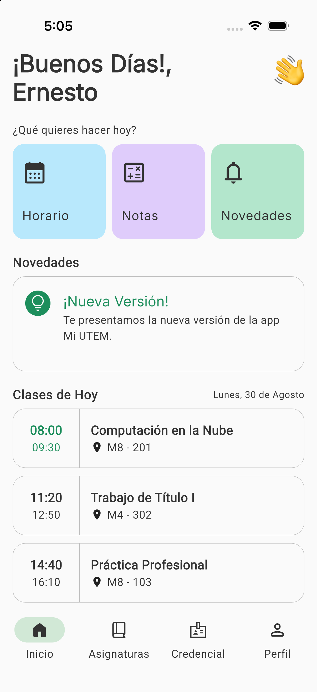

De arriba hacia abajo:

| Bloque | Qué muestra |
| --- | --- |
| **Saludo** | "¡Buenos Días/Tardes/Noches!" según la hora, con tu primer nombre. |
| **¿Qué quieres hacer hoy?** | Accesos rápidos a **Horario**, **Notas** y **Novedades**. |
| **Novedades** | Anuncios del equipo de desarrollo y de la universidad. |
| **Clases de Hoy** | Los bloques del día con hora de inicio/término, nombre del ramo y sala. El bloque en curso se destaca en verde. |

**Gesto disponible**: desliza hacia abajo (*pull to refresh*) para recargar horario, novedades y
datos de sesión desde el servidor.

### Barra de navegación inferior

Las pestañas visibles dependen de tu perfil (estudiante, profesor) y de los *feature flags*
remotos, por lo que pueden variar entre versiones. En esta sesión se mostraron:

**Inicio · Asignaturas · Credencial · Perfil**

La app también incluye una pestaña **Apuntes** (tareas y recordatorios personales), que estaba
desactivada por configuración remota durante esta revisión.

---

## 3. Asignaturas

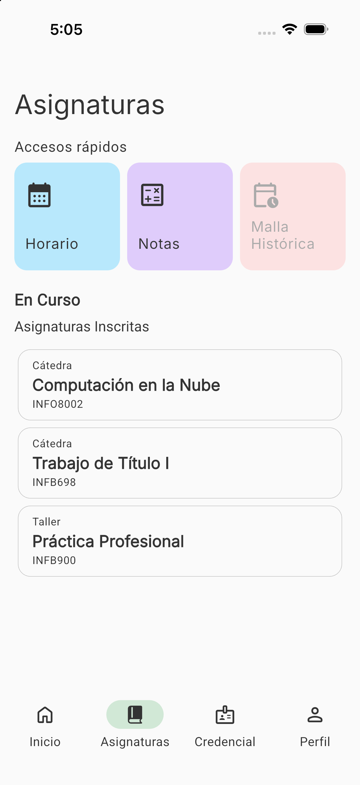

Contiene dos bloques:

- **Accesos rápidos**: Horario, Notas y Malla Histórica.
- **En Curso / Asignaturas Inscritas**: cada tarjeta muestra el tipo de hora (Cátedra, Taller,
  Laboratorio), el nombre del ramo y su código. Al tocar una asignatura se abre su detalle de notas.

También admite *pull to refresh* para recargar la lista desde el sistema académico.

---

## 4. Horario

Se abre desde el acceso rápido **Horario** (en Inicio o en Asignaturas).

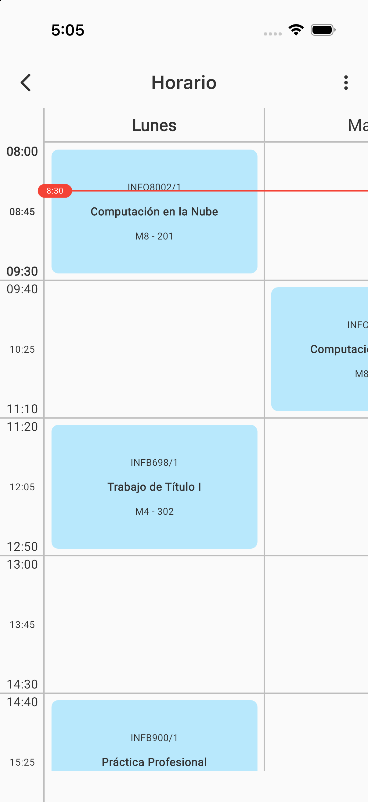

- Vista semanal en cuadrícula: las columnas son los días y las filas los bloques horarios.
- Cada bloque indica **código/sección**, **nombre de la asignatura** y **sala**.
- Una **línea roja con la hora actual** cruza la cuadrícula para ubicarte en el día.
- Se desplaza horizontalmente para ver el resto de la semana y verticalmente para el resto del día.

El menú **⋮** de la barra superior ofrece tres acciones:

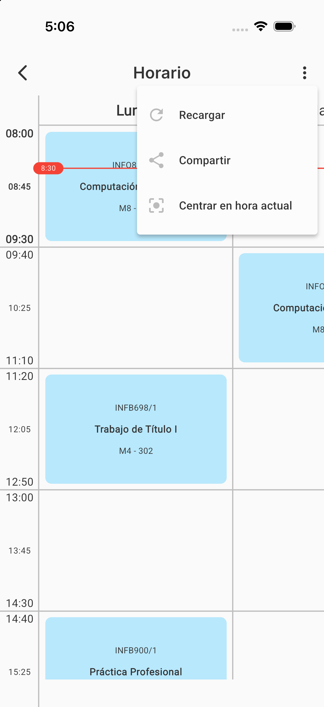

| Opción | Qué hace |
| --- | --- |
| **Recargar** | Fuerza una actualización del horario desde el servidor, ignorando la caché. |
| **Compartir** | Genera una imagen del horario y abre el menú de compartir de iOS/Android. |
| **Centrar en hora actual** | Desplaza la vista hasta el bloque que está corriendo. |

---

## 5. Calculadora de notas

Se abre desde el acceso rápido **Notas**.

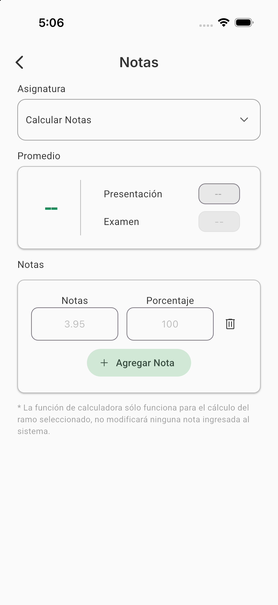

La pantalla tiene tres secciones:

1. **Asignatura**: un selector con la opción libre *"Calcular Notas"* y, debajo, tus ramos inscritos.

   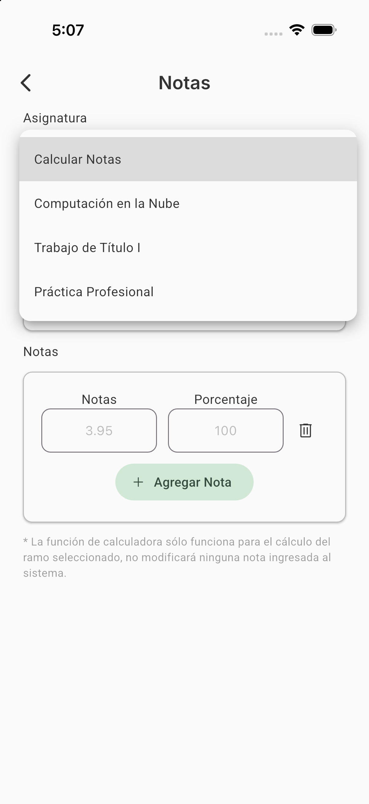

2. **Promedio**: el promedio calculado en grande, más las notas de **Presentación** y **Examen**.
3. **Notas**: pares de *nota* + *porcentaje*. Se agregan filas con **+ Agregar Nota** y se eliminan
   con el ícono de papelera.

Al elegir una asignatura se cargan sus evaluaciones reales y el promedio se recalcula al instante
mientras editas.

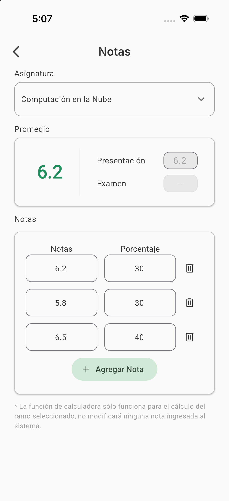

> **Importante**: como advierte la propia pantalla, *la calculadora sólo sirve para simular el
> cálculo del ramo seleccionado; no modifica ninguna nota ingresada al sistema*.

---

## 6. Malla Histórica

Acceso rápido dentro de Asignaturas. Muestra el avance curricular por semestre con el estado de
cada asignatura, y permite compartirla como imagen.

Durante esta revisión la función estaba **desactivada de forma remota** por el equipo:

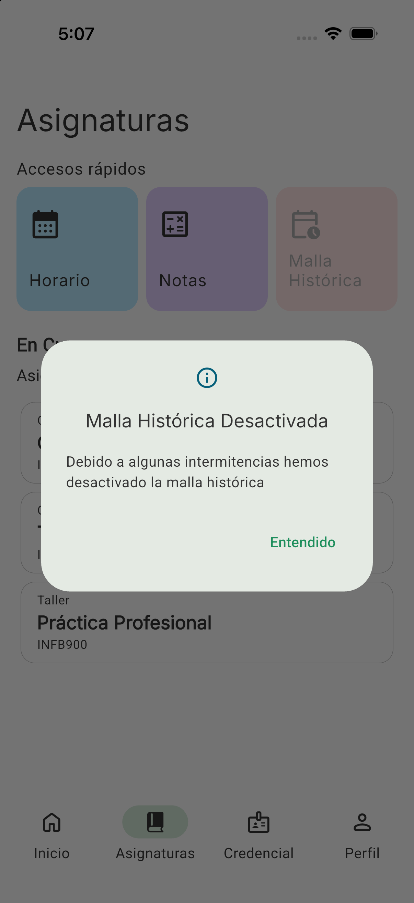

Que una tarjeta se vea atenuada significa que su *feature flag* está apagado. Es un estado temporal
controlado desde el servidor, no un error de tu cuenta ni del teléfono.

---

## 7. Credencial

Tu credencial universitaria digital.

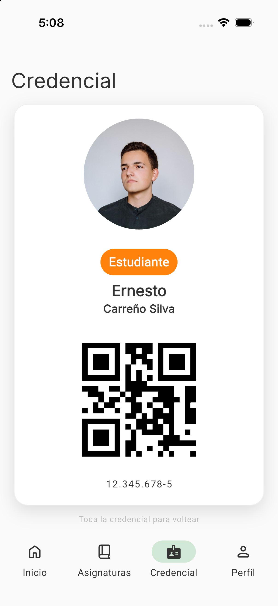

El anverso muestra:

- Tu fotografía institucional.
- Tu **perfil** (Estudiante / Profesor) como distintivo de color.
- Nombre y apellidos.
- Un **código QR** para validación.
- Tu RUT con formato.

Tocando la tarjeta se voltea y muestra el reverso institucional:

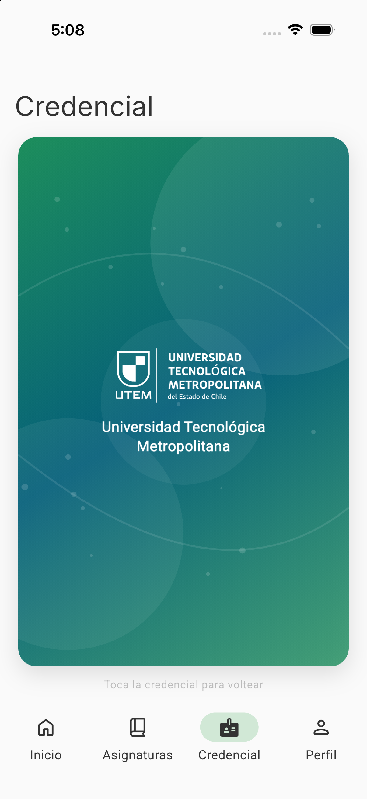

*Pull to refresh* vuelve a pedir tus datos al servidor si tu foto o perfil cambiaron.

---

## 8. Novedades

Se abre desde el acceso rápido **Novedades** del Inicio.

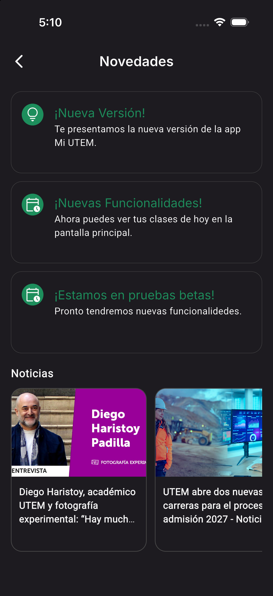

Reúne dos cosas:

- **Anuncios de la app**, publicados por el equipo de desarrollo mediante configuración remota.
- **Noticias** de la UTEM, en tarjetas horizontales con imagen y titular. Al tocarlas se abre la
  noticia completa en el navegador.

---

## 9. Perfil y ajustes

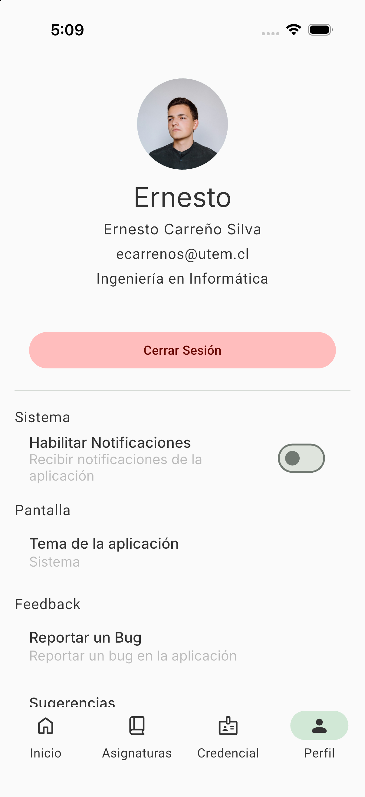

Arriba se muestran tu foto, nombre completo, correo institucional y carrera; debajo, el botón
**Cerrar Sesión**, que borra las credenciales guardadas y te devuelve al login.

Al desplazarte aparecen las secciones de configuración:

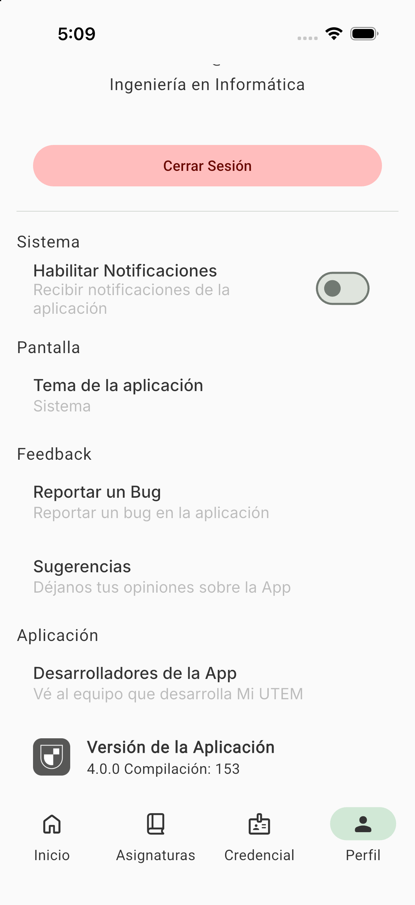

| Sección | Opción | Descripción |
| --- | --- | --- |
| **Sistema** | Habilitar Notificaciones | Activa o desactiva las notificaciones de la app. |
| **Pantalla** | Tema de la aplicación | Claro, Oscuro o seguir el tema del Sistema. |
| **Feedback** | Reportar un Bug | Abre el formulario para reportar fallas. |
| **Feedback** | Sugerencias | Envía comentarios y propuestas al equipo. |
| **Aplicación** | Desarrolladores de la App | Abre la lista de colaboradores en GitHub. |
| **Aplicación** | Versión de la Aplicación | Versión y número de compilación instalados. |

### Cambiar el tema

**Perfil → Pantalla → Tema de la aplicación** abre el selector:

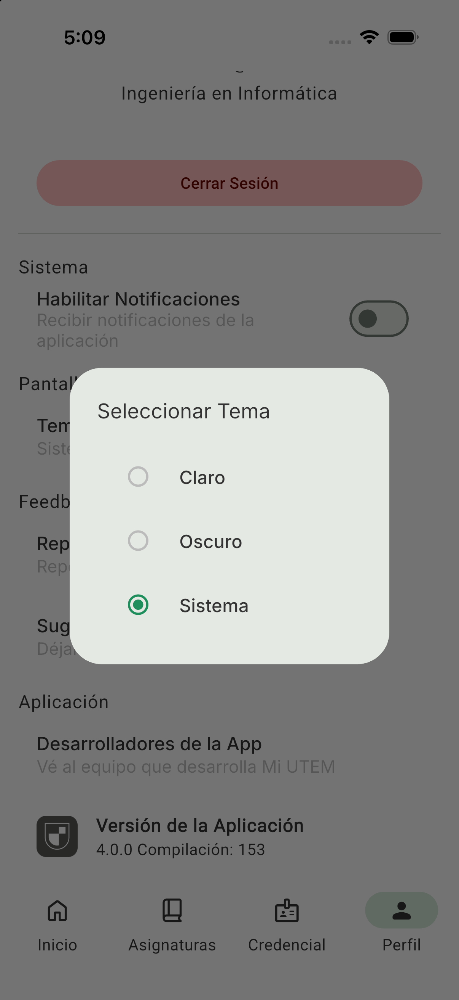

Con **Oscuro**, toda la app adopta la paleta oscura:

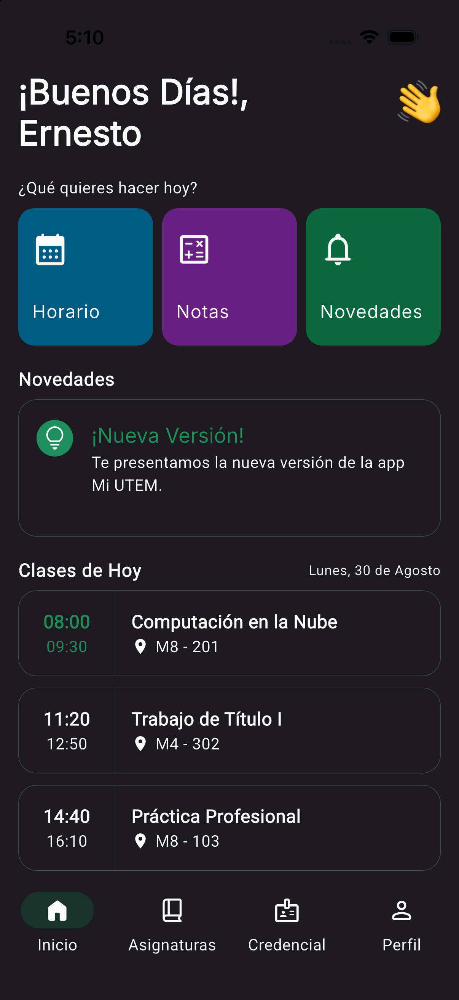

### Modo de depuración (uso interno)

En las compilaciones de desarrollo, tocando **cinco veces** la fila *"Versión de la Aplicación"* se
habilita una sección **Depuración** con el sabor de la app, el ID de usuario, reinicio de sesión y
un generador de errores de prueba. En producción esta opción no está disponible.

---

## 10. Apuntes

La pestaña **Apuntes** (cuando su *feature flag* está activo) es una lista personal de tareas y
recordatorios, guardada localmente en el dispositivo:

- Crear tareas con **título**, **contenido**, **estado**, **categoría** (puede ser una de tus
  asignaturas) y un **color** identificador.
- Marcar, editar y eliminar tareas.
- Recibir recordatorios mediante notificaciones locales.

No estuvo visible durante esta revisión porque la pestaña venía desactivada desde la configuración
remota.

---

## Anexo — Ejecutar la app en el simulador de iOS

Referencia para el equipo de desarrollo; reproduce exactamente lo hecho para esta guía.

### Requisitos

- Flutter con el SDK de iOS configurado y Xcode instalado.
- **CocoaPods funcionando** (`pod --version` debe responder). Si está roto:
  ```bash
  gem install cocoapods --user-install
  ```
  y agrega `~/.gem/ruby/<versión>/bin` al `PATH`.
- Dependencias instaladas:
  ```bash
  flutter pub get
  ```

### Levantar la app con datos de demostración

```bash
flutter run --flavor development -t lib/main_dev.dart --dart-define=SCREENSHOT_MODE=true
```

Con `SCREENSHOT_MODE=true` la app usa `registrarServiciosMock()`: acepta cualquier usuario y
contraseña en el login y devuelve siempre el estudiante ficticio. La sesión vive en memoria, por lo
que cada ejecución parte desde el login.

Para usar el sistema académico real, omite el `--dart-define`.

### Capturas automatizadas para las tiendas

El repositorio incluye un recorrido automatizado que genera las capturas de App Store, Mac App Store
y Play Store. Cada plataforma usa la herramienta de fastlane que le corresponde, y las tres dejan
las capturas enmarcadas con `frameit` y los fondos de `scripts/generate-screenshot-backgrounds`:

| Plataforma | Herramienta | Recorrido | Lane |
| --- | --- | --- | --- |
| iPhone y iPad | [snapshot](https://docs.fastlane.tools/getting-started/ios/screenshots/) (UI Tests de Xcode) | [`ios/RunnerUITests/ScreenshotsUITests.swift`](../ios/RunnerUITests/ScreenshotsUITests.swift) | `bundle exec fastlane ios screenshots` |
| Android | [screengrab](https://docs.fastlane.tools/getting-started/android/screenshots/) (tests instrumentados) | [`android/app/src/androidTest/kotlin/cl/inndev/miutem/ScreenshotsTest.kt`](../android/app/src/androidTest/kotlin/cl/inndev/miutem/ScreenshotsTest.kt) | `bundle exec fastlane android screenshots` |
| macOS | `flutter drive` | [`integration_test/screenshots_test.dart`](../integration_test/screenshots_test.dart) | `bundle exec fastlane mac screenshots` |

macOS va aparte porque snapshot recorre la app con un simulador de iOS y para el escritorio no hay
equivalente.

Los tres recorridos compilan la app con `--dart-define=SCREENSHOT_MODE=true`, así que trabajan con
los datos ficticios y no necesitan ninguna cuenta real. La configuración de snapshot está en
[`fastlane/Snapfile`](../fastlane/Snapfile) y la de screengrab en
[`fastlane/Screengrabfile`](../fastlane/Screengrabfile). En CI los ejecuta el workflow
[`screenshots.yml`](../.github/workflows/screenshots.yml).

### Problemas conocidos al compilar

- **`Command PhaseScriptExecution failed`** en la fase *FlutterFire: upload-crashlytics-symbols*:
  el script busca el binario `Crashlytics/run` bajo `DerivedData/Runner-*/SourcePackages/`, mientras
  que los paquetes se resuelven en `build/ios/SourcePackages/`. Se soluciona enlazando esa ruta:
  ```bash
  ln -sfn "$PWD/build/ios/SourcePackages" ~/Library/Developer/Xcode/DerivedData/Runner-*/SourcePackages
  ```
- **`CocoaPods not installed or not in valid state`**: `pod` está roto o solo accesible vía
  `bundle exec`. Instálalo como gem de usuario (ver más arriba) en vez de envolverlo con bundler:
  Flutter invoca `pod` directamente y con un envoltorio lento el arranque se degrada mucho.
- La primera compilación descarga y compila todo el SDK de Firebase para iOS: puede tomar entre 15 y
  40 minutos. Las siguientes bajan a ~1 minuto.
